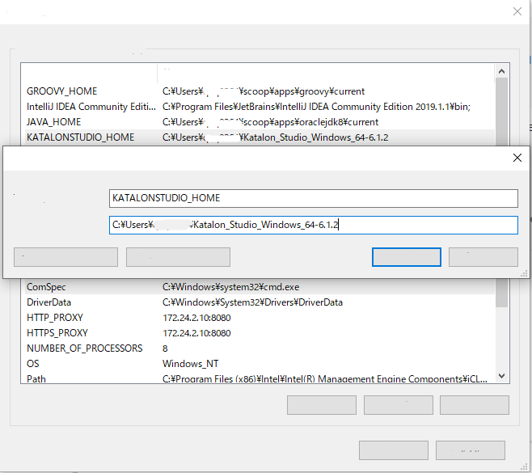

How to make your Katalon Studio project capable of Visual Testing
============

## Overview

This project will show you how to import ["VisualTestingInKatalonStudio"](https://github.com/kazurayam/VisualTestingInKatalonStudio) resources into your own Katalon Studio project. Your project will become capable of screenshot comparison testings as ["VisualTestingInKatalonStudio"](https://github.com/kazurayam/VisualTestingInKatalonStudio) proposes.

Here we inject [Gradle Build Tool](https://gradle.org/) into your Katalon Studio project. A custom Gradle Plugin [`com.github.kazurayam.visualtestinginks`](https://plugins.gradle.org/plugin/com.github.kazurayam.visualtestinginks) has been developed for ["VisualTestingInKatalonStudio"](https://github.com/kazurayam/VisualTestingInKatalonStudio).

## Procedure

In order to make the description easy to understand, I will describe a case of Windows 10 PC. Please interpret it and find for yourself how to do the same on Mac and Linux.

### (1) Create a Katalon Studio project

You can create a new Katalon Studio and make it "Visual Testing-capable". In order to understand a whole picture, it is recommended to start with a new Katalon project.

Here I will explain a case where I create a new Katalon project named **MyProject**.

### (2) Download and extract the 'distributable-gradlew.zip'

Visit the [VisualTestingInKatalonStudio Releases page](https://github.com/kazurayam/VisualTestingInKatalonStudio/releases) with browser. In the latest version, you can find a link to `distributable-gradlew.zip` file. Click the link to download the zip file to your PC. Extract the contents and save them into the `
` of your Katalon Studio project. A folder named `gradle` and three files named `gradlew*` will be added.

The `gradlew` and `gradlew.bat` file are the artifacts of [Gradle Wrapper](https://docs.gradle.org/current/userguide/gradle_wrapper.html). With `gradlew.bat` and the JavaVM installed on your PC, any Gradle build. However, it is obvious, most of the Katalon Studio users do not have Gradle installed in their workbench. Therefore I created `distributable-gradlew.zip` file so that they can utilize Gradle features without installing Gradle.

It can be the case that a Katalon Studio user has Katalon Studio installed but *does NOT have JDK8 installed* in his/her PC. You do not have to install JDK8 because Katalon Studio bundles the Java Runtime Environment. You can use `gradlewks.bat` which referes to Environment variable `KATALONSTUDIO_HOME`. Please defined a OS Environment variable `KATALON STUDIO_HOME` as follows. Then `gradlewks.bat` will use the bundled Java Rutime Environement to run Gradle.

(3) Make `build.gradle` file in the project root directory

(4) Stop Katalon Studio GUI if it is up

Project clean
